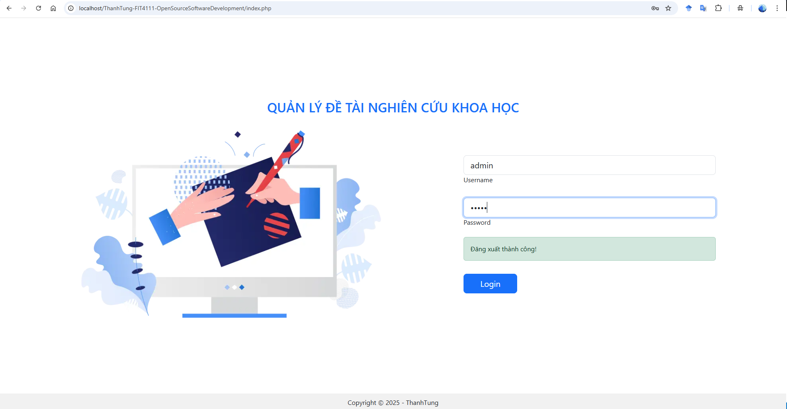
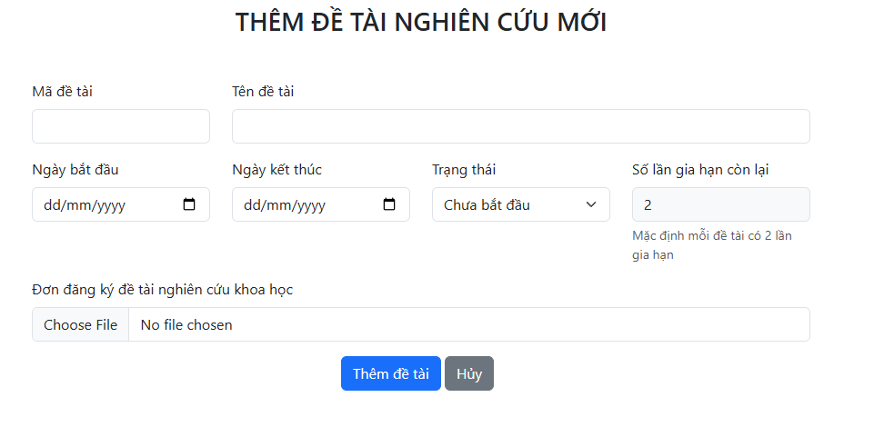

<link rel="stylesheet" href="https://cdnjs.cloudflare.com/ajax/libs/font-awesome/6.0.0/css/all.min.css">

<h2 align="center">
    <a href="https://dainam.edu.vn/vi/khoa-cong-nghe-thong-tin">
    <i class="fas fa-graduation-cap"></i> Faculty of Information Technology (DaiNam University)
    </a>
</h2>
<h2 align="center">
    Open Source Software Development
</h2>
<div align="center">
    <p align="center">
        
        
        
    </p>

[](https://www.facebook.com/DNUAIoTLab)
[](https://dainam.edu.vn/vi/khoa-cong-nghe-thong-tin)
[](https://dainam.edu.vn)

</div>

## <i class="fas fa-book-open"></i> 1. Giới thiệu
Hệ thống Quản lý Đề tài Nghiên cứu Khoa học là một ứng dụng web được phát triển trong khuôn khổ học phần FIT4111 - Open Source Software Development. Hệ thống cung cấp giải pháp toàn diện cho việc quản lý đề tài nghiên cứu khoa học tại các trường đại học, bao gồm quản lý sinh viên, giảng viên, đề tài, theo dõi tiến độ thực hiện và các hoạt động báo cáo. 

Dự án được xây dựng với mục tiêu tạo ra một nền tảng mã nguồn mở hiệu quả, dễ sử dụng và có khả năng mở rộng, giúp các tổ chức giáo dục tối ưu hóa quy trình quản lý nghiên cứu khoa học.

## <i class="fas fa-tools"></i> 2. Các công nghệ được sử dụng
<div align="center">

### Hệ điều hành
[](https://www.microsoft.com/en-us/windows)
[](https://ubuntu.com/)
[](https://www.apple.com/macos/)

### Công nghệ chính
[](https://www.php.net/)
[](https://developer.mozilla.org/en-US/docs/Web/HTML)
[](https://developer.mozilla.org/en-US/docs/Web/CSS)
[](https://developer.mozilla.org/en-US/docs/Web/JavaScript)
[](https://getbootstrap.com/)

### Cơ sở dữ liệu
[](https://www.mysql.com/)

### Môi trường phát triển
[](https://www.apachefriends.org/)
</div>

## <i class="fas fa-images"></i> 3. Chức năng hệ thống

### 3.1. Bảng điều khiển tổng quan
<div align="center">
  
  <p><em>Giao diện bảng điều khiển tổng quan hiển thị thống kê hệ thống</em></p>
</div>

<div align="center">
  
  <p><em>Thống kê chi tiết về số lượng sinh viên, giảng viên, đề tài</em></p>
</div>

<div align="center">
  
  <p><em>Biểu đồ trực quan hóa dữ liệu hệ thống</em></p>
</div>

- <i class="fas fa-chart-bar"></i> Hiển thị thống kê tổng quan về hệ thống
- <i class="fas fa-chart-line"></i> Theo dõi số lượng sinh viên, giảng viên, đề tài
- <i class="fas fa-clipboard-list"></i> Báo cáo tình trạng đề tài theo thời gian thực
- <i class="fas fa-search"></i> Tìm kiếm nhanh thông tin trong hệ thống

### 3.2. Đăng nhập và xác thực

- <i class="fas fa-lock"></i> Hệ thống cho phép người dùng đăng nhập với vai trò admin hoặc user thông thường
- <i class="fas fa-shield-alt"></i> Bảo mật thông tin và quản lý phiên làm việc an toàn
- <i class="fas fa-sync-alt"></i> Khôi phục mật khẩu và xác thực người dùng

<div align="center">
  
  <p><em>Giao diện đăng nhập hệ thống quản lý đề tài nghiên cứu khoa học</em></p>
</div>

### 3.3. Quản lý sinh viên

- <i class="fas fa-user-graduate"></i> Thêm, sửa, xóa thông tin sinh viên
- <i class="fas fa-chart-pie"></i> Theo dõi tiến độ học tập của sinh viên
- <i class="fas fa-filter"></i> Tìm kiếm và lọc danh sách sinh viên theo nhiều tiêu chí
- <i class="fas fa-file-export"></i> Xuất báo cáo danh sách sinh viên
- <i class="fas fa-envelope"></i> Quản lý thông tin liên lạc sinh viên
<div align="center">
  
  <p><em>Giao diện danh sách sinh viên với các chức năng CRUD</em></p>
</div>

<div align="center">
  
  <p><em>Form thêm mới sinh viên với validation dữ liệu</em></p>
</div>

<div align="center">
  
  <p><em>Form chỉnh sửa thông tin sinh viên</em></p>
</div>

<div align="center">
  
  <p><em>Hệ thống phân trang và tìm kiếm sinh viên</em></p>
</div>

### 3.4. Quản lý giảng viên

- <i class="fas fa-chalkboard-teacher"></i> Quản lý thông tin cá nhân và chuyên môn của giảng viên
- <i class="fas fa-book"></i> Phân công giảng viên hướng dẫn đề tài
- <i class="fas fa-tasks"></i> Theo dõi số lượng đề tài đang hướng dẫn
- <i class="fas fa-archive"></i> Lưu trữ lịch sử hướng dẫn đề tài
<div align="center">
  
  <p><em>Danh sách giảng viên với thông tin chi tiết</em></p>
</div>

<div align="center">
  
  <p><em>Form đăng ký thông tin giảng viên mới</em></p>
</div>

<div align="center">
  
  <p><em>Cập nhật thông tin và chuyên môn giảng viên</em></p>
</div>

<div align="center">
  
  <p><em>Thống kê số lượng đề tài hướng dẫn</em></p>
</div>

<div align="center">
  
  <p><em>Danh sách giảng viên với thông tin chi tiết</em></p>
</div>

<div align="center">
  
  <p><em>Form đăng ký thông tin giảng viên mới</em></p>
</div>

<div align="center">
  
  <p><em>Cập nhật thông tin và chuyên môn giảng viên</em></p>
</div>

<div align="center">
  
  <p><em>Thống kê số lượng đề tài hướng dẫn</em></p>
</div>

### 3.5. Quản lý đề tài

- <i class="fas fa-plus-circle"></i> Tạo mới, chỉnh sửa và xóa đề tài
- <i class="fas fa-tags"></i> Phân loại đề tài theo lĩnh vực và độ khó
- <i class="fas fa-calendar-alt"></i> Theo dõi thời gian thực hiện đề tài
- <i class="fas fa-chart-bar"></i> Thống kê tình trạng đề tài (mới, đang thực hiện, hoàn thành)
- <i class="fas fa-paperclip"></i> Đính kèm tài liệu và file PDF
<div align="center">
  
  <p><em>Danh sách đề tài với trạng thái và tiến độ</em></p>
</div>

<div align="center">
  
  <p><em>Form tạo đề tài nghiên cứu mới</em></p>
</div>

<div align="center">
  
  <p><em>Thông tin chi tiết và cập nhật đề tài</em></p>
</div>

<div align="center">
  
  <p><em>Quản lý file tài liệu đề tài</em></p>
</div>

### 3.6. Chi tiết đề tài

- <i class="fas fa-edit"></i> Mô tả chi tiết yêu cầu và mục tiêu của đề tài
- <i class="fas fa-users"></i> Danh sách sinh viên tham gia đề tài
- <i class="fas fa-user-tie"></i> Thông tin giảng viên hướng dẫn
- <i class="fas fa-chart-line"></i> Theo dõi tiến độ thực hiện từng giai đoạn
- <i class="fas fa-link"></i> Liên kết đến mã nguồn và tài liệu liên quan
<div align="center">
  
  <p><em>Giao diện quản lý chi tiết đề tài</em></p>
</div>

<div align="center">
  
  <p><em>Quản lý thành viên tham gia đề tài</em></p>
</div>

<div align="center">
  
  <p><em>Phân công vai trò và nhiệm vụ</em></p>
</div>

<div align="center">
  
  <p><em>Giao diện quản lý chi tiết đề tài</em></p>
</div>

<div align="center">
  
  <p><em>Quản lý thành viên tham gia đề tài</em></p>
</div>

<div align="center">
  
  <p><em>Phân công vai trò và nhiệm vụ</em></p>
</div>

### 3.7. Gia hạn đề tài

- <i class="fas fa-clock"></i> Đăng ký gia hạn thời gian thực hiện đề tài
- <i class="fas fa-file-alt"></i> Nộp đơn xin gia hạn với lý do cụ thể
- <i class="fas fa-check-circle"></i> Phê duyệt hoặc từ chối yêu cầu gia hạn
- <i class="fas fa-calendar-check"></i> Cập nhật thời hạn mới cho đề tài

<div align="center">
  
  <p><em>Danh sách các yêu cầu gia hạn đề tài</em></p>
</div>

<div align="center">
  
  <p><em>Form đăng ký gia hạn thời gian thực hiện</em></p>
</div>

<div align="center">
  
  <p><em>Quy trình phê duyệt yêu cầu gia hạn</em></p>
</div>

### 3.8. Báo cáo đề tài

- <i class="fas fa-calendar-plus"></i> Lập lịch trình báo cáo đề tài
- <i class="fas fa-user-friends"></i> Phân công hội đồng đánh giá
- <i class="fas fa-clipboard"></i> Quản lý nội dung và tài liệu báo cáo
- <i class="fas fa-chart-bar"></i> Theo dõi kết quả đánh giá
<div align="center">
  
  <p><em>Quản lý các buổi báo cáo đề tài</em></p>
</div>

<div align="center">
  
  <p><em>Lên lịch và sắp xếp buổi báo cáo</em></p>
</div>

- <i class="fas fa-calendar-plus"></i> Lập lịch trình báo cáo đề tài
- <i class="fas fa-user-friends"></i> Phân công hội đồng đánh giá
- <i class="fas fa-clipboard"></i> Quản lý nội dung và tài liệu báo cáo
- <i class="fas fa-chart-bar"></i> Theo dõi kết quả đánh giá

<div align="center">
  
  <p><em>Quản lý các buổi báo cáo đề tài</em></p>
</div>

<div align="center">
  
  <p><em>Lên lịch và sắp xếp buổi báo cáo</em></p>
</div>

### 3.9. Chi tiết báo cáo đề tài

- <i class="fas fa-pen"></i> Ghi nhận điểm số và nhận xét từ hội đồng
- <i class="fas fa-calculator"></i> Tính toán điểm trung bình và xếp loại
- <i class="fas fa-file-contract"></i> Lưu trữ biên bản đánh giá chi tiết
- <i class="fas fa-trophy"></i> Công bố kết quả và xếp hạng

<div align="center">
  
  <p><em>Nhập điểm đánh giá từ các giảng viên</em></p>
</div>

<div align="center">
  
  <p><em>Thống kê và báo cáo kết quả đánh giá</em></p>
</div>

## <i class="fas fa-cog"></i> 4. Cài đặt

### 4.1. Cài đặt XAMPP

#### 4.1.1. Tải XAMPP
- Truy cập trang chủ [XAMPP](https://www.apachefriends.org/download.html)
- Tải phiên bản XAMPP phù hợp với hệ điều hành của bạn (Windows, Linux, macOS)

#### 4.1.2. Cài đặt XAMPP
- Mở tệp cài đặt vừa tải xuống và làm theo hướng dẫn hiển thị trên màn hình
- Đảm bảo các thành phần Apache, MySQL và PHP được chọn trong quá trình cài đặt
- Hoàn tất cài đặt và khởi động XAMPP Control Panel

#### 4.1.3. Khởi động các dịch vụ
- Trong XAMPP Control Panel, khởi động dịch vụ Apache và MySQL
- Kiểm tra hoạt động bằng cách truy cập `http://localhost` trên trình duyệt

### 4.2. Cài đặt dự án

#### 4.2.1. Clone repository
```
git clone https://github.com/yourusername/ThanhTung-FIT4111-OpenSourceSoftwareDevelopment.git
```

#### 4.2.2. Di chuyển mã nguồn
- Sao chép toàn bộ thư mục dự án vào đường dẫn `htdocs` của XAMPP (thường là `C:\xampp\htdocs\` trên Windows)

#### 4.2.3. Thiết lập cơ sở dữ liệu
- Truy cập phpMyAdmin qua `http://localhost/phpmyadmin`
- Tạo một cơ sở dữ liệu mới có tên `quanly_detainghiencuukhoahoc`
- Nhập các tệp SQL từ thư mục gốc dự án:
  - `ChatGPT_CoSoDuLieu.sql` - Cấu trúc database chính
  - `ChatGPT_CoSoDuLieu_Trigger.sql` - Các trigger và stored procedures

#### 4.2.4. Cấu hình kết nối
- Mở tệp `functions/db_connection.php` và kiểm tra thông tin kết nối cơ sở dữ liệu:
```php
$servername = "localhost";
$username = "root";
$password = "ThanhTung"; // Hoặc mật khẩu MySQL của bạn
$dbname = "quanly_detainghiencuukhoahoc";
$port = 3306;
```

#### 4.2.5. Truy cập ứng dụng
- Mở trình duyệt và truy cập `http://localhost/ThanhTung-FIT4111-OpenSourceSoftwareDevelopment`
